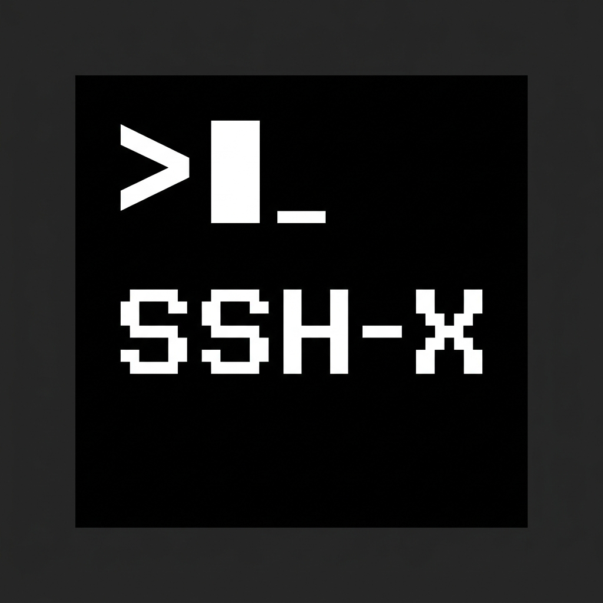

# SSH-X

[English](README.md) | **Русский**

**Ретро-монохромный SSH / SFTP / FTP / Telnet и локальный терминал для macOS.**

<p>
  
  
  
  
</p>



## Возможности

| Область | Что умеет |
|---|---|
| **SSH** | Пароль и приватный ключ, проверка host key по принципу trust-on-first-use в собственном `known_hosts`, явный отказ при смене ключа (защита от MITM) |
| **SFTP** | Встроенный файловый менеджер в каждой сессии: навигация, загрузка (диалог + drag & drop), скачивание, переименование, создание папки, удаление, копирование пути/имени, прогресс передачи. Работает и с хостами, запрещающими интерактивный shell (NAS с выключенным SSH, chroot/SFTP-only аккаунты) — такие сессии открываются в режиме «только файлы» вместо ошибки. Плюс SFTP есть отдельным протоколом при подключении: сессия открывается сразу файловым менеджером на всю панель, а терминал — одной кнопкой `SHOW TERMINAL` |
| **FTP / FTPS** | FTP с явным TLS, тот же файловый менеджер и прогресс, плюс встроенная консоль команд |
| **Telnet** | Клиент с полноценным парсером IAC (в т.ч. разорванные между пакетами последовательности) и согласованием размера окна NAWS |
| **Локальный терминал** | Login-shell (`zsh -l`) прямо внутри приложения — `~/.zprofile` и PATH подхватываются; принудительный UTF-8 locale, чтобы кириллица в GUI-запуске не ломалась |
| **Табы и сплиты** | Несколько табов, каждый делится по горизонтали/вертикали на независимые панели с изменяемой шириной |
| **Менеджер сессий** | Сохранённые подключения, пароли зашифрованы AES-256-GCM, атомарная запись, права `0600`; секреты вообще не покидают главный процесс |
| **UX терминала** | xterm.js + JetBrains Mono (шрифт лежит локально, без сети), история 10 000 строк, автофокус при переключении таба/клике/ресайзе, контекстное меню с copy/paste/select all/clear |

### Безопасность

- `contextIsolation: true`, `sandbox: true`, `nodeIntegration: false`
- Строгий CSP и заголовки `nosniff` / `X-Frame-Options: DENY` в продакшене
- Все IPC-каналы проверяют окно-отправитель; локальные пути для загрузки обязаны быть обычными файлами
- Пароли шифруются ключом, производным от секрета, который хранится в `userData` на этой машине
- Рендерер никогда не получает сохранённые секреты — они подставляются только в главном процессе в момент подключения
- `window.open` и уход со страницы приложения запрещены

## Требования

- macOS 11+ (Apple Silicon или Intel — сборка universal)
- Node.js 20+ и npm

## Разработка

```bash
git clone https://github.com/lxstatmose/ssh-x.git
cd ssh-x
npm install          # заодно чинит права spawn-helper у node-pty (postinstall)

npm run dev          # Vite dev server + Electron с HMR
```

Отдельный шаг пересборки нативных модулей не нужен: `node-pty` поставляется с
N-API prebuild-бинарниками под обе архитектуры, а `ssh2` — со своим готовым
crypto-биндингом, поэтому в `electron-builder.yml` стоит `npmRebuild: false`
(подробности в комментарии там же).

| Скрипт | Что делает |
|---|---|
| `npm run dev` | Режим разработки (Vite + Electron, devtools открыты) |
| `npm run typecheck` | Проверка типов рендерера |
| `npm run lint` | ESLint |
| `npm run build` | Сборка рендерера в `dist/renderer` |
| `npm run verify` | typecheck + lint + build (то же, что в CI) |
| `npm run package` | Universal DMG в `release/` |

## Сборка дистрибутива

```bash
npm run package      # dist + electron-builder -> release/ssh-x-<version>-universal.dmg
```

`electron-builder.yml` собирает один **universal** DMG. `node-pty`
поставляется с prebuild-бинарниками под обе архитектуры, поэтому из сборки
намеренно исключены `build/Release` и `bin/`, а `node-pty` откатывается на
`prebuilds/<platform>-<arch>`; настройки merge ASAR сохраняют чужие слайсы.
Нативные модули под Electron не пересобираются (`npmRebuild: false`), так как
`cpu-features` — опциональная зависимость `ssh2` — основана на Nan и не
компилируется под V8 из Electron 42; `ssh2` без неё использует JS-реализацию.

```bash
open release/mac-universal/ssh-x.app      # запустить распакованное universal-приложение
```

## Релизы (CI/CD)

`ci.yml` гоняет `npm run verify` (typecheck + lint + build) на каждый push в `main`
и на каждый pull request. Релизы привязаны к тегам и запускаются вручную:

```bash
npm version patch        # или minor / major; бампает package.json, коммитит, ставит тег
git push --follow-tags   # пуш тега vX.Y.Z запускает release.yml
```

Дальше `release.yml` проверяет, что тег совпадает с версией из `package.json`,
прогоняет тот же гейт `verify`, собирает universal DMG через `electron-builder`
и публикует GitHub-релиз, где единственный файл — этот DMG (плюс автоматически
прикреплённые GitHub'ом Source code zip/tar.gz). Сборка идёт до публикации —
упавший билд не может оставить релиз без артефактов.

Что полезно знать:

- тег **обязан** совпадать с версией в `package.json` (иначе workflow упадёт) —
  `npm version` держит их синхронно;
- релиз можно запустить и вручную (*Actions → Release → Run workflow*),
  передав имя существующего тега;
- без опциональных секретов подписи (`CSC_LINK`, `CSC_KEY_PASSWORD`, `APPLE_ID`,
  `APPLE_APP_SPECIFIC_PASSWORD`, `APPLE_TEAM_ID`) артефакты будут без подписи —
  пользователям понадобится шаг для Gatekeeper из раздела «Если что-то не работает»;
- release notes генерирует GitHub из коммитов между тегами — пиши осмысленные
  заголовки коммитов (`fix(sftp): ...`, `feat(terminal): ...`).

## Структура проекта

```
ssh-x/
├── src/
│   ├── main/                  # главный процесс Electron
│   │   ├── main.js            # окно, CSP, хранилище сессий, IPC
│   │   ├── preload.js         # contextBridge-API: window.api
│   │   ├── sshManager.js      # ssh2, known_hosts, операции SFTP
│   │   ├── ptyManager.js      # локальный шелл (node-pty)
│   │   ├── ftpManager.js      # basic-ftp + прогресс передачи
│   │   └── telnetManager.js   # парсер telnet (IAC/NAWS)
│   └── renderer/              # UI на React + TypeScript
│       ├── App.tsx            # табы, сайдбар, quick connect, модалки
│       ├── components/        # SessionTab, SftpExplorer, FtpExplorer, ...
│       ├── style.css          # ретро-монохромная тема
│       └── global.d.ts        # общие типы и контракт window.api
├── scripts/                   # dev-runner, фикс прав node-pty
├── electron-builder.yml
└── package.json
```

## Если что-то не работает

**Приложение не подписано (предупреждение Gatekeeper при первом запуске).**
Откройте через правый клик → *Открыть* либо:

```bash
xattr -dr com.apple.quarantine /Applications/ssh-x.app
```

**"Spawn failed: posix_spawnp failed."** — `npm` снимает бит выполнения с
`spawn-helper` из `node-pty`. `npm install` исправляет это автоматически
(postinstall); вручную: `node scripts/fix-pty-perms.js`.

**Кириллица в локальном терминале печатается криво** — шелл запущен без
UTF-8 locale. SSH-X сам выставляет `en_US.UTF-8`, если locale не задан, и не
трогает ваши `LANG`/`LC_ALL`.

**Поехала ASCII-графика / глифы не выровнены** — xterm.js измеряет метрики
шрифта в момент `open()`. Встроенный шрифт подключён с `font-display: block`, и
терминал дожидается загрузки шрифта до открытия — если меняете файлы шрифтов,
сохраняйте этот контракт.

## Планы

- [ ] Горячие клавиши и меню приложения (⌘T, ⌘W, ⌘1–9, ⌘D — сплит, ⌘F — поиск)
- [ ] Поиск по скроллбеку, broadcast-ввод во все панели таба
- [ ] Проброс портов (local/remote/dynamic SOCKS) и цепочки jump-host
- [ ] Аутентификация через `ssh-agent`, keyboard-interactive (MFA), генерация ключей
- [ ] Импорт хостов из `~/.ssh/config`
- [ ] Двухпанельный локальный ↔ удалённый файловый менеджер, рекурсивные операции
- [ ] Темы/профили терминала, восстановление сессии, логирование сессий
- [ ] Shell integration (OSC 7/133): текущая папка в заголовке таба, «follow terminal folder»

## Участие

Issues и pull requests приветствуются. Используй Conventional Commits
(`fix(sftp): ...`, `feat(terminal): ...`) — они попадают в release notes.
Уязвимости сообщай приватно через
[security advisories](../../security/advisories/new), а не публичными issue.

## Поддержка

> **USDT (TRC20)**: `TXW6HqP7WkroKyu4jMi6A643if2cQ2QWAu`  
> **TON**: `UQCBkdr09Hj6zZ6eSHTs0vA6A_w56w9Yh_o1xLjQHtXrgO9J`  
> **ETH**: `0x3F56eCbA65b6E57B622FA477f1c663c8C7D7cc27`  

Проект полностью бесплатен для всех.  
Однако его развитие и стабильная работа при росте числа пользователей требуют вложений.  
Буду благодарен за любую форму поддержки! Спасибо!

## Лицензия

[ISC](LICENSE)
